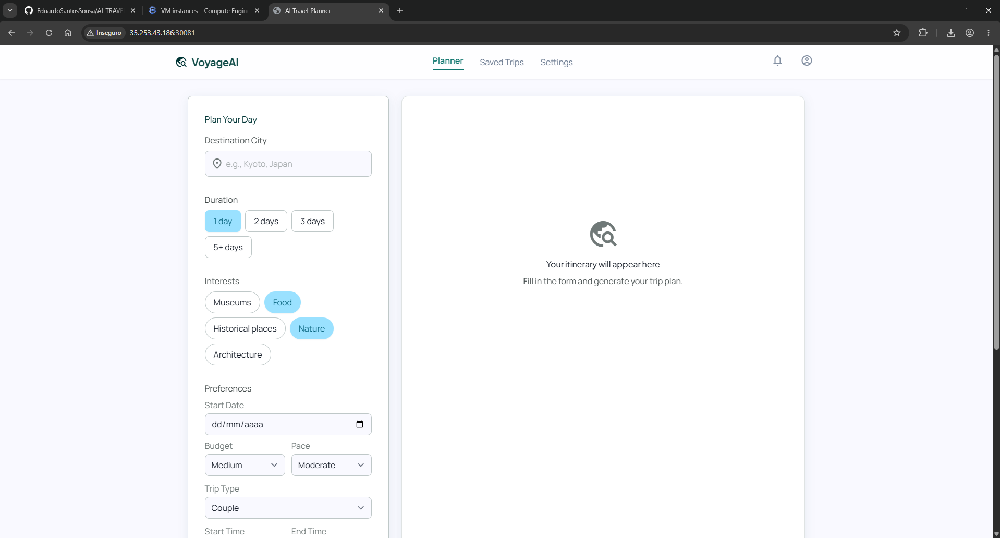
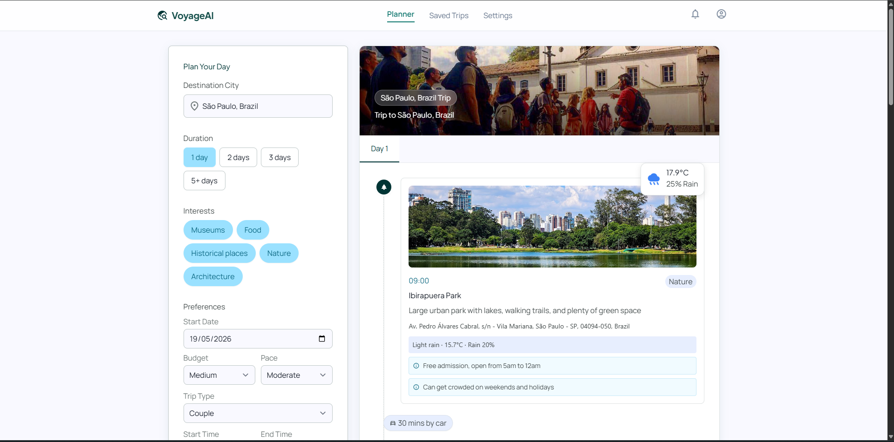
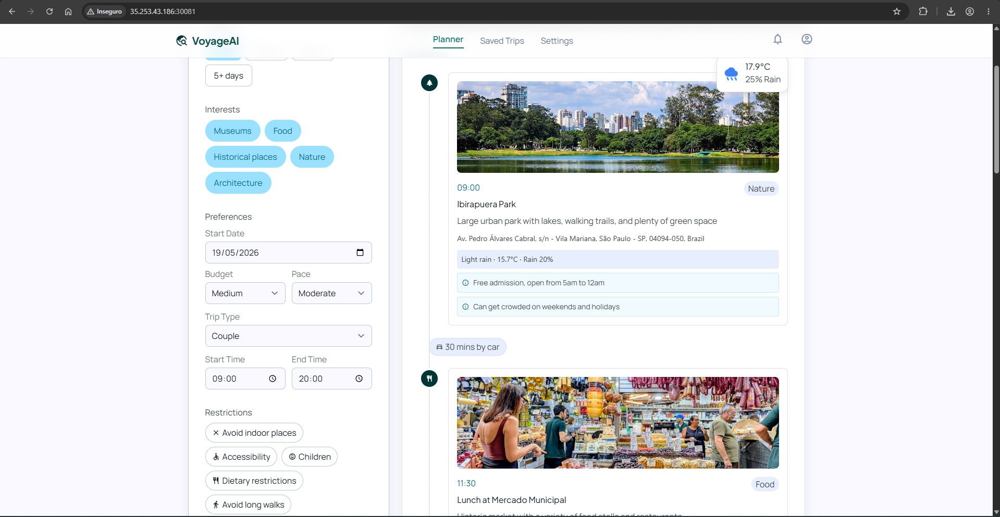
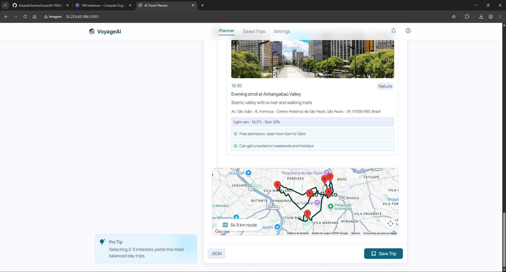
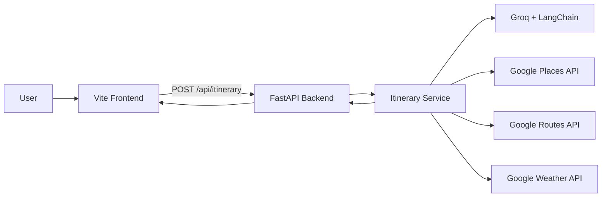
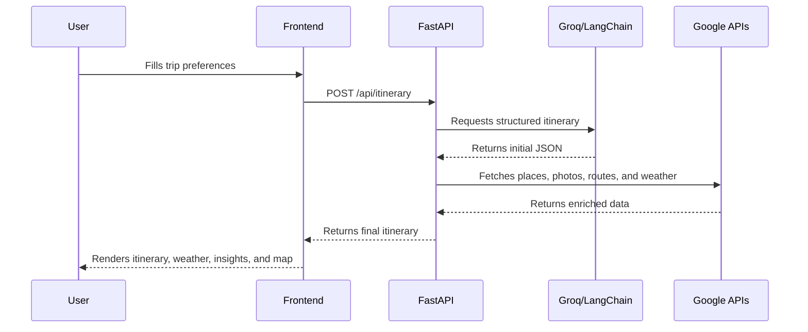
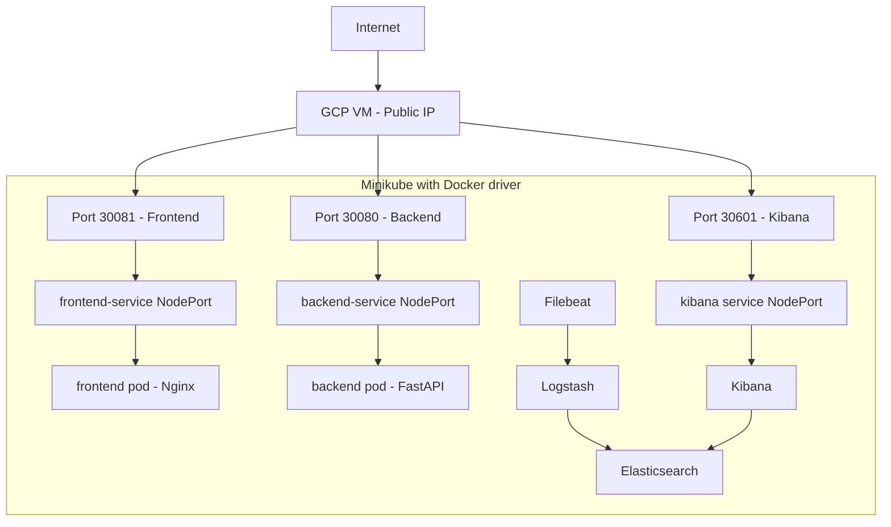
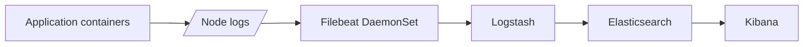

# AI Travel Agent

<p align="center">
  
</p>

<p align="center">
  <strong>An AI-powered travel itinerary planner with real place data, routes, weather enrichment, and a modern web interface.</strong>
</p>

<p align="center">
  <a href="https://youtu.be/lGdjtgXqGq0">Demo Video</a>
  |
  <a href="#features">Features</a>
  |
  <a href="#architecture">Architecture</a>
  |
  <a href="#deployment-with-docker-kubernetes-and-gcp">Deployment</a>
</p>

---

## Overview

**AI Travel Agent** is a full stack application that generates personalized travel itineraries. The user provides a destination, trip duration, interests, budget, pace, trip type, schedule, and restrictions. The application uses AI to generate a structured itinerary and then enriches each stop with real place data, images, route information, and weather forecasts.

The project started as a Streamlit prototype and evolved into a more production-oriented architecture:

- **Frontend** built with Vite, HTML, JavaScript, and Tailwind CSS.
- **Backend** built with FastAPI.
- **Generative AI** powered by LangChain and Groq.
- **Geographic enrichment** using Google Places, Routes, and Weather APIs.
- **Containerization** with Docker.
- **Orchestration** with Kubernetes and Minikube.
- **Observability** with Elasticsearch, Logstash, Filebeat, and Kibana.

## Demo

Watch the main feature demonstration:

<p align="center">
  <a href="https://youtu.be/lGdjtgXqGq0">
    
  </a>
</p>

<p align="center">
  <a href="https://youtu.be/lGdjtgXqGq0"><strong>Watch demo on YouTube</strong></a>
</p>

## Screenshots

The images below are stored in `doc/img` and show the project experience.

<p align="center">
  
  
</p>

<p align="center">
  
  
</p>

## Features

- Generates structured travel itineraries as JSON.
- Supports destination, interests, number of days, budget, pace, trip type, schedule, and restrictions.
- Adds a destination cover image.
- Enriches every itinerary stop with real Google Places data.
- Calculates routes, distance, duration, and encoded polylines with Google Routes.
- Looks up hourly weather forecasts with Google Weather.
- Shows alerts and recommendations when weather may affect the trip.
- Regenerates the itinerary when bad weather makes the original plan less practical.
- Renders itinerary cards, timelines, insights, weather, and maps in the frontend.
- Runs locally, with Docker, or on Kubernetes/Minikube inside a GCP VM.
- Includes a logging stack with Filebeat, Logstash, Elasticsearch, and Kibana.

## Product Idea

The goal of the project is to reduce the manual work involved in planning a trip. Instead of researching places, arranging visit order, checking travel time, and verifying weather separately, the user receives a first itinerary draft that is already enriched and ready to explore.

The project combines three layers:

- **AI reasoning** to understand user preferences and generate the itinerary.
- **Geographic APIs** to turn AI suggestions into real places, routes, and weather-aware plans.
- **A web interface** to make the itinerary interactive and easy to inspect.

## Architecture



### Itinerary Generation Flow



### VM Deployment With Minikube



### Observability



## Project Structure

```text
AI-TRAVEL-AGENT/
|-- backend/
|   |-- main.py
|   |-- schemas.py
|   `-- services/
|       |-- itinerary_service.py
|       |-- place_service.py
|       |-- route_service.py
|       `-- weather_service.py
|-- config/
|   `-- config.py
|-- core/
|   `-- planner.py
|-- doc/
|   |-- DESIGN.md
|   |-- code.html
|   `-- img/
|-- frontend/
|   |-- src/
|   |-- Dockerfile
|   |-- index.html
|   `-- package.json
|-- k8s/
|-- src/
|   `-- chains/
|       `-- itinerary_chain.py
|-- Dockerfile.backend
|-- requirements.txt
`-- README.md
```

## Main Components

### Backend

The backend is a FastAPI application responsible for receiving user preferences and coordinating the itinerary generation pipeline.

Main endpoints:

```text
POST /api/itinerary
POST /api/itinerary/regenerate-for-weather
GET  /docs
```

Important files:

- `backend/main.py`: creates the FastAPI app and registers the endpoints.
- `backend/schemas.py`: defines Pydantic request and response models.
- `backend/services/itinerary_service.py`: coordinates AI, Places, Routes, and Weather enrichment.
- `backend/services/place_service.py`: fetches places, photos, and destination cover images.
- `backend/services/route_service.py`: calculates travel routes between itinerary stops.
- `backend/services/weather_service.py`: adds forecast data and weather risk levels.
- `src/chains/itinerary_chain.py`: contains the LangChain/Groq prompts.

### Frontend

The frontend is a web interface for planning and visualizing the trip. It collects preferences, sends them to the API, and renders the final itinerary with cards, day tabs, insights, weather data, and map sections.

Main files:

```text
frontend/src/main.js
frontend/src/api/itineraryApi.js
frontend/index.html
```

For containerized or production-like usage, the frontend must be built with the public backend URL:

```bash
docker build \
  --build-arg VITE_API_BASE_URL="http://PUBLIC_VM_IP:30080" \
  -t ai-travel-frontend:v1 \
  ./frontend
```

## Environment Variables

Create a `.env` file in the project root for local execution:

```env
GROQ_API_KEY=your_groq_api_key
GOOGLE_MAPS_API_KEY=your_google_maps_api_key
```

Google APIs used by the project:

- Places API (New)
- Routes API
- Weather API
- Maps JavaScript API, if the map is loaded in the browser

Never commit `.env` files or real API keys to GitHub.

## Local Execution

### Backend

```powershell
python -m venv venv
.\venv\Scripts\Activate.ps1
python -m pip install -r requirements.txt
python -m uvicorn backend.main:app --reload
```

Open:

```text
http://127.0.0.1:8000/docs
```

### Frontend

```powershell
cd frontend
npm install
npm run dev
```

Open:

```text
http://localhost:5173
```

## Docker

Build the backend image:

```bash
docker build -f Dockerfile.backend -t ai-travel-backend:v1 .
```

Run the backend container:

```bash
docker run --rm -p 8080:8080 \
  -e GROQ_API_KEY="your_groq_api_key" \
  -e GOOGLE_MAPS_API_KEY="your_google_maps_api_key" \
  ai-travel-backend:v1
```

Build the frontend image:

```bash
docker build \
  --build-arg VITE_API_BASE_URL="http://localhost:8080" \
  -t ai-travel-frontend:v1 \
  ./frontend
```

Run the frontend container:

```bash
docker run --rm -p 5173:8080 ai-travel-frontend:v1
```

## Deployment With Docker, Kubernetes, And GCP

The project includes Kubernetes manifests in the `k8s` directory. The study deployment flow used in this project is:

1. Create an Ubuntu VM on GCP.
2. Install Docker, kubectl, and Minikube.
3. Start Minikube with the Docker driver.
4. Build the images inside Minikube's Docker environment.
5. Apply Secrets, Deployments, and Services.
6. Expose the backend, frontend, and Kibana with NodePort.

Main commands inside the VM:

```bash
minikube start \
  --driver=docker \
  --cpus=4 \
  --memory=12288 \
  --disk-size=25g \
  --ports=30080:30080 \
  --ports=30081:30081 \
  --ports=30601:30601
```

```bash
eval $(minikube docker-env)

docker build -f Dockerfile.backend -t ai-travel-backend:v1 .

docker build \
  --build-arg VITE_API_BASE_URL="http://PUBLIC_VM_IP:30080" \
  -t ai-travel-frontend:v1 \
  ./frontend
```

Create the backend Secret:

```bash
kubectl create secret generic ai-travel-backend-secret \
  --from-literal=GROQ_API_KEY="your_groq_api_key" \
  --from-literal=GOOGLE_MAPS_API_KEY="your_google_maps_api_key"
```

Apply the application manifests:

```bash
kubectl apply -f k8s/backend-deployment.yaml
kubectl apply -f k8s/backend-service.yaml
kubectl apply -f k8s/frontend-deployment.yaml
kubectl apply -f k8s/frontend-service.yaml
```

Expected access URLs:

```text
Frontend: http://PUBLIC_VM_IP:30081
Backend:  http://PUBLIC_VM_IP:30080/docs
Kibana:   http://PUBLIC_VM_IP:30601
```

## Logging And Monitoring

The observability stack follows this flow:

```text
Filebeat -> Logstash -> Elasticsearch -> Kibana
```

Apply the logging resources:

```bash
kubectl apply -f k8s/logging-namespace.yaml
kubectl apply -f k8s/elasticsearch.yaml
kubectl apply -f k8s/logstash.yaml
kubectl apply -f k8s/kibana.yaml
kubectl apply -f k8s/filebeat.yaml
```

Validate:

```bash
kubectl get pods -n logging
kubectl get services -n logging
```

## Example Request

```json
{
  "city": "New York",
  "interests": ["Food", "Museums", "Architecture"],
  "days": 2,
  "start_date": "2026-05-06",
  "budget": "medium",
  "pace": "moderate",
  "trip_type": "couple",
  "start_time": "09:00",
  "end_time": "20:00",
  "restrictions": ["Avoid long walks"]
}
```

High-level expected response shape:

```text
city
title
summary
cover_image
days[].items[]
days[].items[].place
days[].items[].weather
days[].items[].insights
days[].route
itinerary_weather
```

## Technical Decisions

- **FastAPI** was chosen because it is simple, fast, and provides automatic OpenAPI documentation.
- **LangChain + Groq** organize LLM calls and structured JSON generation.
- **Google Places/Routes/Weather** add real-world data to the AI-generated itinerary.
- **Vite** provides a lightweight frontend workflow for a modern web experience.
- **Docker** makes the backend and frontend reproducible.
- **Kubernetes** is used to practice Deployments, Services, Secrets, NodePort, and observability patterns.
- **ELK + Filebeat** demonstrates how to collect, process, store, and inspect container logs.

## Known Limitations

- Google Weather API may not return data for every coordinate or date.
- The frontend must be built with `VITE_API_BASE_URL` pointing to the correct backend URL.
- When using Minikube with the Docker driver inside a VM, NodePort may require explicit port mappings during `minikube start`.
- For a real production deployment, GKE with Ingress, HTTPS, domains, and managed secrets would be a better fit.
- API keys should be protected with usage restrictions and never committed to source control.

## Roadmap Ideas

- Authentication and saved trip history.
- Export to PDF or calendar.
- Public itinerary sharing.
- Caching for external API calls.
- Support for multiple weather providers.
- GKE deployment with Ingress and HTTPS.
- Automated tests for backend and frontend.
- CI/CD with GitHub Actions.

## Project References

- Demo: [YouTube](https://youtu.be/lGdjtgXqGq0)
- Deployment guide: `PROCEDIMENTOS_DOCKER_GCP.txt`
- Design system: `doc/DESIGN.md`
- Initial visual prototype: `doc/code.html`
